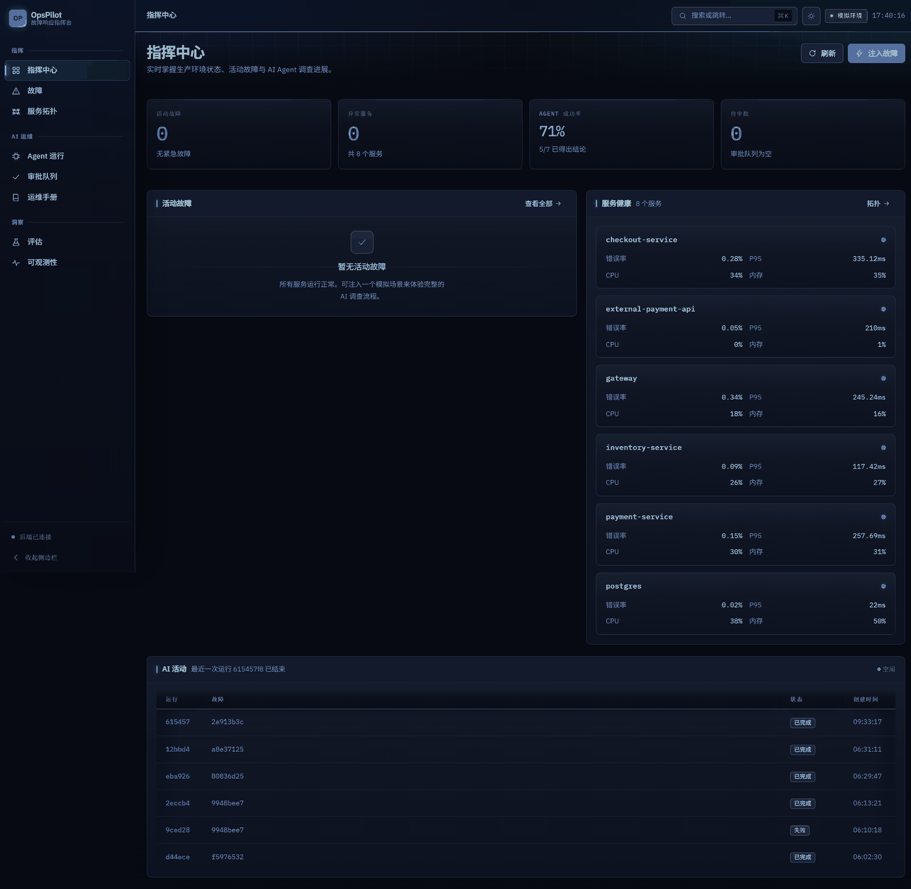
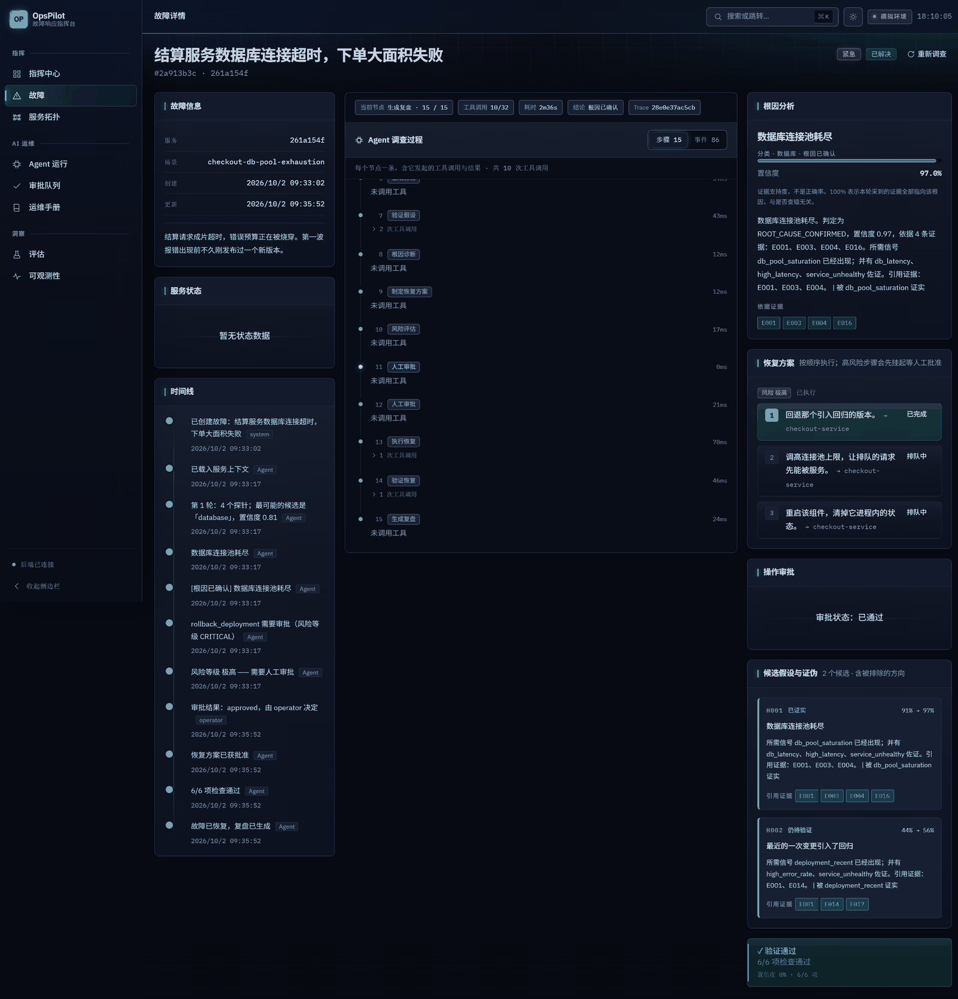
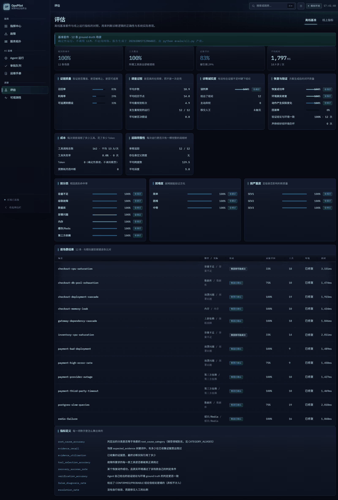
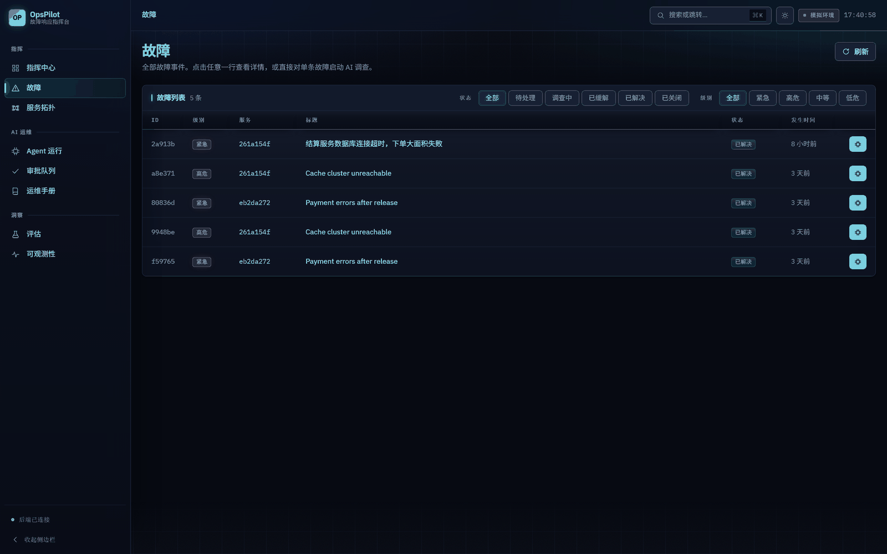
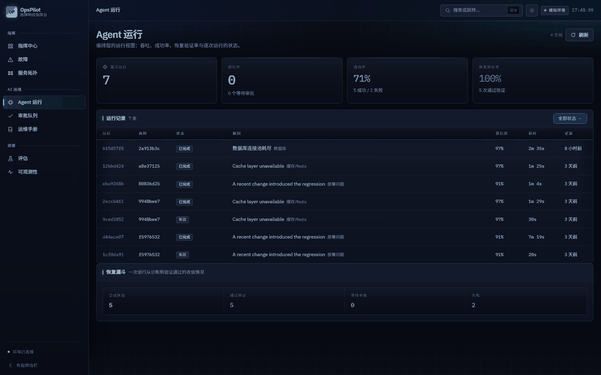
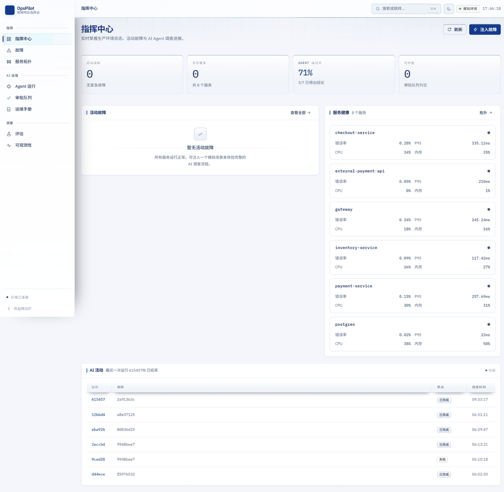

# OpsPilot

**AI 事故响应系统** — 一个自己跑完「发现 → 调查 → 诊断 → 计划 → 审批 → 执行 → 验证 → 回滚 → 复盘」的 Agent 运行时。

线上地址：**https://opspilot-v2.app.workbuddy.host/**

打开后点「注入故障」选一个场景，再点「开始调查」，就能看着 Agent 一步步调工具、改主意、给出诊断。
想先读代码：`apps/backend/src/opspilot_backend/agent/graph.py` 和 `services/agent_stream.py`。



---

## 它解决的是什么问题

值班工程师遇到告警时的真实流程是：看指标 → 翻日志 → 查最近部署 → 凭经验猜 → 试一下 → 反复。
每一步都要人做，中间过程不留痕，事后复盘时没人说得清当初为什么排除了某个假设。

OpsPilot 把这段流程交给一个**状态机驱动的 Agent**，并且要求它把每一步都落库：
调了哪个工具、拿到什么证据、提出哪些假设、哪些被否掉、为什么否掉、诊断置信度多少、恢复动作有没有生效。
可以实时看着它跑，也可以事后翻完整的调查账本。

关键约束是**不许编**。诊断允许输出 `UNKNOWN`，验证失败就是失败，恢复后指标没回基线就触发回滚。
一个会说「我没查出来」的系统，比一个总能给出漂亮答案的系统更适合放在生产旁边。

---

## 一次调查里发生了什么

15 个节点跑在 LangGraph 的 `StateGraph` 上（`agent/graph.py`），每个节点声明自己的 stage、超时、预算和失败语义（`agent/node_spec.py`）。

| Stage | 做什么 |
|---|---|
| `load_context` | 拉服务拓扑、依赖、当前健康态，建调查上下文 |
| `triage` | 定级（SEV1–4）、圈定受影响面、划时间窗 |
| `investigation_planner` | 规划要采哪些证据，而不是把工具全调一遍 |
| `parallel_investigation` | 并发跑工具调用，任一超时不阻塞其余 |
| `evidence_aggregation` | 证据归一化、去重、标注可信度与时效 |
| `hypothesis_generation` | 生成候选假设并给出置信度 |
| `hypothesis_verification` | **主动找反驳证据**，能证伪就退回重新规划 |
| `root_cause_diagnosis` | 出根因、类别与把握程度；证据不足就弃权 |
| `recovery_planner` | 生成分步恢复方案（含回滚点） |
| `risk_assessment` | 按动作风险定审批策略 |
| `human_approval` | 人在环闸门（LangGraph `interrupt`） |
| `recovery_executor` | 逐步执行，每步记录是否真正改变了环境 |
| `rollback` | 执行失败或验证不通过时按方案回退 |
| `verification` | 回查指标，判断是否真的恢复 |
| `postmortem` | 生成复盘：时间线、证据链、被否假设、遗留风险 |

循环不是装饰。评测里 12/12 次运行都发生了重新规划，平均 4.9 轮、18.9 步、14 个 stage。
一个只会一条道走到黑的流程不需要 15 个节点。



上面这张是一次真实运行的详情页：17 条证据、2 个候选假设、置信度 0.97、恢复动作分三步（已完成 / 待执行 / 预检）、
右侧是根因分析引用了哪几条证据（E001 / E003 / E004 / E016），底部是回查结果 `6/6 项检查通过`。

### 状态与断点

- `agent/state.py` 定义 `IncidentState`，节点只返回增量，不原地改。
- `agent/checkpointer.py` 把 LangGraph 的检查点落到项目自己的仓储层，所以一次运行可以在进程重启后继续，
  被人审批打断的流程也能从 `human_approval` 恢复而不是从头再来。
- `agent/budget.py` 给每次运行设 token / 工具调用 / 墙钟预算，越界即停并记明原因。

---

## 工具层：22 个工具，每个都带权限和风险等级

工具定义在 `tools/registry.py`，声明式，不是散落的函数。

| 权限 | 数量 | 工具 |
|---|---|---|
| `read_only` | 10 | `get_service_status` `query_logs` `query_metrics` `get_deployments` `get_recent_commits` `get_dependencies` `search_runbooks` `get_runbook` `notify_oncall` `verify_service_health` |
| `mutate_infra` | 8 | `restart_service` `scale_service` `restart_redis` `flush_cache` `restart_postgres` `increase_pool_size` `clear_deadlock` `enable_circuit_breaker` |
| `destructive` | 2 | `rollback_deployment` `restart_postgres` |
| `write_external` | 2 | `switch_payment_provider` `create_github_issue` |

权限分四档而不是两档，是因为「改自己的基础设施」和「动外部支付通道」要走的审批和审计路径不一样。
`rollback_deployment` 也算 `destructive`：回滚会改变线上流量走向，它需要真正的回滚点，而不只是「再部署一次」。

每个 `ToolSpec` 还声明 `input_model` / `output_model`（pydantic 双向校验）、`timeout_s`、`max_retries`、
`risk_level`、可预期的 `error_types`、所属 `mcp_server`。几个刻意的设计：

- **超时是每个工具的属性，不是全局常量。** 查日志 5 秒、重启服务 30 秒，用同一个数字要么误杀要么白等。
- **幂等键。** `tools/executor.py` 带请求指纹，重复调用返回首次结果而不是再重启一次服务。
- **钩子。** `tools/hooks.py` 在调用前后插审计和指标，写操作调用点无法绕过。
- **MCP。** 工具通过 MCP 协议暴露，Agent 侧只认 spec，换后端不用改节点代码。

---

## 恢复安全：分级审批 + 真的回滚

恢复动作按风险分级，策略在 `agent/recovery.py`：

| 风险 | 典型动作 | 行为 |
|---|---|---|
| `low` | 单实例重启、临时扩容 | 自动执行 |
| `medium` | 滚动重启、配置热更新、清缓存 | 自动执行，留审计 |
| `high` | 回滚部署、切换支付通道 | 挂起等人工批准，拒绝即终止 |
| `critical` | 数据变更、删除类动作 | 直接拦下，不进入审批队列 |

执行完必须验证：`verification` 回查指标，没回基线就走 `rollback`。
评测里 `effective_action_rate` 和 `environment_fixed_rate` 分开统计，就是为了区分
「动作返回成功」和「环境真的被修好了」。

**诊断的诚实度是单独一项指标。** `diagnosis_honesty.false_diagnosis_rate` 统计「自信地给出了错误根因」，
`recovery.success_rate` 统计「宣称成功但环境仍然坏着」。这两项比根因准确率更能说明系统能不能信。

---

## 模型接入

模型走 provider 抽象（`agent/llm.py`），两个实现：

- `deterministic` — 规则引擎，不需要外部依赖，跑测试和评估时用。
- `openai_compatible` — 任何 OpenAI 兼容端点，通过 `OPENAI_BASE_URL` / `OPENAI_MODEL` / `OPENAI_API_KEY` 配置。

`get_llm()` 返回进程级单例，运行记录里的 `reasoning_mode` 如实反映当前用的是哪一个。
判断模型是否真被调用不能看这个字段，要看 `usage.tokens`。

提示词上的三条硬规矩：

1. **要求 JSON 就必须写明 JSON 的 schema。** 含糊地说「优化一下推理过程」，模型会回一段散文，
   解析失败、输出被丢弃，而 token 已经扣了。现在提示词显式规定「只回 JSON 数组、每项一个 `reasoning` 键、
   40 词内、不要 markdown 围栏」，并在「扣了 token 却解析失败」时记 `llm.unusable_reply` 事件。
   一次典型假设生成从 651 个 token 浪费掉，降到 147–170 个 token 正常落库。
2. **证据不足允许弃权。** `root_cause_diagnosis` 可以产出 `UNKNOWN`，这条路径计入 `escalated`，
   不算失败也不算成功。
3. **输出语言在提示词里锁死。** 界面是中文的，提示词不写死语言，模型就会按自己的语料习惯回英文句子，
   于是「中文界面里夹一段英文根因」。`hypothesis_generation` 和 `postmortem` 的 system prompt
   都显式写了「只用中文作答」，并限定「不要 markdown 围栏、不要任何说明文字」。

---

## 评测：12 个场景，每个都能追到证据

`evals/` 是独立的一层，不依赖后端进程，直接跑运行时并出报告。

```bash
cd evals && python cli.py
```

最近一次结果（也是前端「评估」页读的那份）：

| 指标 | 值 |
|---|---|
| 场景数 / 错误数 | 12 / 0 |
| 根因准确率 | **1.00** |
| 诊断类别准确率 | **1.00**（7 个类别全对） |
| 工具选择准确率 | **1.00** |
| 恢复成功率 | **1.00**（`effective_action_rate` 1.00，`rollback_rate` 0.00） |
| 验证准确率 | **1.00**（12 条计分，0 次「宣称成功但环境未恢复」） |
| 误诊断率 | **0.00** |
| 证据召回 / 利用率 / 可追溯 | 0.826 / 0.292 / 0.332 |
| 平均步数 / 平均 stage 数 | 18.92 / 14.0 |
| 平均重新规划轮数 | 4.92（12/12 次都重规划过） |
| 工具调用总数 | 162（平均 13.5，失败 0 次） |
| 延迟 平均 / p50 / p95 / max | 1237 / 1193 / 1787 / 2099 ms |
| Trace | 12 次单一 root，0 个悬空 parent，平均 126 个 span，深度 5 |

根因、工具选择、恢复、验证四项是 1.00，说明在已定义的场景上闭环是稳的。
**证据利用率只有 0.29 才是真问题**：Agent 采到的证据里有七成没被写进最终诊断的引用里。



---

## 前端

React 19 + TypeScript + Vite，9 个页面。





- **SSE 事件流**。`GET /api/v1/agent/runs/{id}/stream` 从 `seq 0` 回放落库的完整事件日志，然后转到实时跟随。
  断线重连带 `Last-Event-ID`，服务端从游标续传，所以断连不会在时间线上留一个洞。
  已结束的运行照样能看完整历史——回放读的是数据库，不是内存里的环形缓冲。
- **时间线有两个页签且都只说真话**。「步骤」来自节点执行记录（含每次工具调用的耗时和结果），
  「事件」来自 SSE 事件日志。没有一份数据是从运行快照反推出来的——反推出来的时间线无法展示
  重新规划、被否掉的假设或回滚，而这三样恰好是能看出 Agent 在思考而不是在背稿的地方。
- **候选假设与证伪**（`components/HypothesisPanel.tsx`）。运行记录只存了结论（根因、置信度），
  推理过程在事件日志里：`hypothesis.created` 开候选、`hypothesis.updated` 动它的状态与证据、
  `hypothesis.rejected` 关掉它。`lib/hypotheses.ts` 把这些事件按 `seq` 折叠成每个候选的完整轨迹，
  包括置信度的**变化过程**——H002 从 44% 爬到 56% 和它一开始就是 56% 是两回事。
  只展示赢的那个等于没展示：一个只会输出最终假设的系统不值得信任，被排除的方向和它被排除的
  依据才是「不编」这句话的证据。
- **拓扑图**用 dagre 做分层布局，节点颜色只编码健康度；健康度未知就画成灰色，不画成绿色。
- **文案分层**：接口里的枚举值、工具名、指标名、服务名、厂商名一律保持英文原样
  （`ROOT_CAUSE_CONFIRMED`、`latency_p95`、`acme-pay`），因为它们要么参与匹配、要么是别人系统的名字。
  给用户看的句子则全部走中文词表：后端 `domain/enums.py` 的 `zh_incident_status()` / `zh_risk()` /
  `zh_outcome()`，前端 `lib/labels.ts` 与 `i18n.ts`。同一份词表只放一处。
- **框架自己的英文也要收**：被拒的请求默认返回 pydantic 的 `Input should be a valid UUID...`，
  而 `api/client.ts` 有一段专门把这些 `msg` 拼起来渲染的分支——也就是说这句话有通路到屏幕上。
  现在 `main.py` 注册了 `RequestValidationError` 处理器：`detail` 换成中文句子，
  结构化的 `type`/`location` 原样留在 `errors` 里——那是定位字段的依据，翻译它等于删掉信息。

### 视觉体系

样式是单向驱动的：`index.css` 依次导入 `tokens → base → shell → primitives → patterns → pages`，
所有颜色只来自 CSS 变量，组件里没有写死的色值。

**深色是默认。** 这是 3am 被读的事故控制台。浅色是一次点击可切的变体（顶栏日月图标），不是二等公民。



暗底下区分层级靠**三件事协作**，不是只靠阴影——近黑底上阴影几乎不可见，只用阴影做层级是深色 UI 发闷的根因：
实心 surface 的一档亮度差 + 带强调色相的发丝边 + 1px 顶部高光（`--sheen`）。

两条贯穿全站的语义色承担实际功能，不是装饰：

- **operator 蓝 `#2563eb` = 人点的**（按钮、可点链接、选中前的态）
- **machine 青 `#22d3ee` = Agent 做的**（徽章、实时状态、导航激活态、机器产生的数据）

有了这条分界，扫一眼就知道某个色块是人做的还是机器做的。所以侧栏激活项、表格选中行、
命令面板当前项、Agent 阶段图统一用青色，而不是各自用蓝色。

**记忆点只有一个**：顶栏底边那道 7 秒循环的「脉冲地平线」扫描线。它是整个产品里唯一允许动的 chrome 元素——
再多就会从「这是活的」变成「这里在动」，而后者不传递信息。`prefers-reduced-motion: reduce` 时它停成一道静态微光。

对比度不是估的，是量出来的。`scripts/ui_probe.py` 用真 Chrome 把 20 组关键前景/背景组合的
`getComputedStyle` 结果读回来算 WCAG 比值（走多层 alpha 合成，不是取令牌字面值），
五路由 × 三档视口 × **深浅两个主题**跑下来各 20/20 全部达标。深色最低一项是
`--muted-foreground` 在 `--surface-inset` 上的 4.85:1，浅色最低 4.57:1。
亮填充按钮（青 / 绿 / 红）配白字只有 1.8–2.8:1，所以它们统一用近黑字 `--text-on-bright`（6.8–10.5:1）。

---

## 部署：单端口托管

线上跑的是 `scripts/build_deploy.py` 打出来的一个单元：

```
deploy/
├── src/            # 后端 + 内嵌模拟器
├── webroot/        # 编译好的 SPA
├── runbooks/       # 知识库
├── opspilot.db     # SQLite（只带 schema，不带数据）
├── requirements.txt
└── serve.py        # 入口
```

`opspilot.db` 是**空表 + 完整 schema**，并在头部写入本次构建的时间戳。首屏那一条故障由
`OPSPILOT_DEMO_SEED` 在启动时按场景定义生成。启动时先核对那个戳：托管平台的上传是覆盖式的，
SQLite 的 `-wal` 会让上一版的数据库接管新文件，而两者的 schema 完全相同、`integrity_check` 也都是 `ok`
——只有戳能分辨。不匹配就把 `.db` 连同 `-wal`/`-shm` 一起删掉重建，然后补写戳。

`serve.py` 用一个 FastAPI 进程同时提供 API、SSE、模拟器和 SPA（catch-all 回落到 `index.html`）。
`OPSPILOT_EMBED_SIMULATOR=true` 会把故障模拟器挂到 `/__sim` 并把 provider 指回自己，
所以托管环境不需要第二个进程。

```bash
python scripts/build_deploy.py     # 需要先跑过前端 build
cd deploy && python serve.py
```

`build_deploy.py` 不替你跑前端 build，而是校验 `dist/` 比所有前端源文件都新，否则直接拒绝。
一份陈旧的产物是一份完全合法的产物：服务端跑得对、仓库里代码是对的，只有浏览器里还是旧字符串，
没有任何一步会报错。

---

## 本地运行

前置：Python 3.12+、Node 20+。

```bash
# 后端（默认 SQLite，零外部依赖）
cd apps/backend
python -m venv .venv && ./.venv/Scripts/activate     # Windows
pip install -r requirements.txt
python serve.py                                       # http://localhost:8000

# 前端
cd apps/frontend
npm install
npm run dev                                           # http://localhost:5173
```

开发模式下前后端分离（Vite 5173，后端 8000，CORS 已配）。单端口模式由 `scripts/build_deploy.py` 负责：

```bash
cd apps/frontend && npm run build
cd ../.. && python scripts/build_deploy.py
cd deploy && python serve.py
```

要在本地试完整栈（含 Prometheus / Grafana / Loki / Postgres / Redis 共 10 个服务）：

```bash
docker compose up -d
```

**接真实模型**（可选，不配就用确定性 provider）：

```bash
cp .env.example .env
# OPENAI_BASE_URL=https://...   OPENAI_MODEL=<模型名>   OPENAI_API_KEY=<key>
```

---

## 测试

```bash
cd apps/backend
PYTHONPATH=src python -m pytest tests -q          # 135 passed
cd apps/frontend && npx tsc -b && npx oxlint      # 类型 + lint
cd evals && python cli.py                         # 12 个场景的端到端评估
```

后端测试覆盖的是**失败路径**：`test_failure_recovery_paths.py`（工具失败、超时、级联失败）、
`test_recovery_rollback.py`（恢复不生效时的回退）、`test_tool_idempotency.py`（重复调用不重复生效）、
`test_tracing.py`（span 血缘完整）、`test_agent_timeline.py`（时间线事件契约）、
`test_incident_lifecycle.py`（状态机合法迁移）。

另外几组守的是「不报错但结果不对」的那类问题：`test_status_labels.py` 断言每个线上枚举值都有中文标签；
`test_deploy_database.py` 断言部署库只带 schema；`test_shipped_database.py` 断言启动时能认出
「这不是本次发布带的数据库」并重建；`test_validation_errors.py` 断言被拒绝的请求不会把 pydantic 的英文
原样送到浏览器；`test_prose_containers.py` 用 AST 扫描所有 f-string，拦住中文句子里的 Python repr。

### 前端验证

静态检查看不见三类问题：色对但层不对（前景在浅一档的 surface 上掉到 4.41:1）、
选择器从未命中（类名拼错，激活态从来没存在过）、窄屏溢出。所以有两个真浏览器脚本：

```bash
# ui_probe：对比度 + 溢出，每页三档视口，深浅两个主题
# readme_shots：README 配图，等到页面数据落地再截
chrome.exe --headless=new --remote-debugging-port=9222 --remote-allow-origins=* \
  --user-data-dir=.tmp/chrome about:blank &

MSYS_NO_PATHCONV=1 MSYS2_ARG_CONV_EXCL='*' python scripts/ui_probe.py \
  http://127.0.0.1:5175 .tmp/shots / /incidents /evaluations --both
```

两个细节让它的结果可信：比值取自 `getComputedStyle` 并**向上遍历到第一个不透明底色**，
所以浮在 `--surface-inset` 上的元素量的是合成后的实际值；主题写进 localStorage 之后**再断言一次**
`document.documentElement.dataset.theme`，不匹配直接抛错——因为探针原本继承环境里已有的 localStorage，
「验浅色主题」实际量的是深色那一套。

---

## 工程记录

这一节留在这里是因为它们是真实发生过的，而且每一个都只在特定环境才暴露。

**1. 「部署跑不起来」和「本地跑得起来」是两件事。**
干净 venv 只装 `requirements.txt` 时，SQLAlchemy 的 async 引擎在 import 阶段就报 `No module named 'greenlet'`——
传递依赖在本地 .venv 里被别的包带进来了。修法是把 `sqlalchemy[asyncio]` 写清楚，而不是往环境里补一个包。
判定「能不能部署」的标准因此改成：全新 venv 跑一遍。

**2. 路径硬编码在 import 阶段爆炸。**
`_RUNBOOK_ROOT = parents[5] / "runbooks"` 把六层目录结构写死了。沙箱里的布局少一层，
直接 IndexError 崩在 import，连日志都来不及打。改成向上搜索锚点 + 环境变量可覆盖。

**3. `.env` 对 import 期的代码是隐形的。**
`main.py` 在 pydantic 真正加载 `.env` 之前，就读了 `os.environ` 里的开关。
结果 `.env` 里明明写着 `OPSPILOT_EMBED_SIMULATOR=true`，代码读到的是 `None`，模拟器没挂上，
所有 provider 调用 503——而日志指向一个根本不存在的伴随进程。
修法是加 `_bootstrap_env_file()`，在 import 期把 `.env` 灌进 `os.environ`，用 `setdefault` 让真实环境变量优先。

**4. 本机代理会劫持回环调用。**
`httpx` 默认 `trust_env=True`，会去读 `http_proxy`。在带透明代理的机器上，后端对自己 `/__sim` 的调用
被送给代理，代理回 404。同一个 URL `curl` 返回 200、`httpx` 返回 404。
修法是加 `trust_env` 参数，并用 `_targets_this_host()` 判定目标是否本机，本机就绕开代理；调外部模型不受影响。

**5. 被扣了 token 却没拿到结果，而且没人知道。**
提示词只说「refine these hypotheses' reasoning」，没说格式。模型回了一段散文，JSON 解析返回 `None`，
代码 `if isinstance(parsed, list)` 直接跳过——token 扣了，输出静默丢弃，日志里一个字都没有。
两处都要改：提示词显式写明 schema，以及「扣了 token 但解析失败」必须记事件。

**6. 元数据说谎比没有元数据更糟。**
`reasoning_mode` 只在创建运行时写了一次，之后没人更新，所以用了模型的运行也对外宣称 `deterministic`。
改成从 `get_llm().name` 推导。

**7. 声明了但从未注册的东西。**
`domain/errors.py` 的注释写着「API 层是唯一把 AppError 转成 HTTP 响应的地方」，
但全项目没有任何 `add_exception_handler`。于是所有领域错误都漏成空 body 的 500，
调用方无法区分「这个事件已经在跑了」和「服务坏了」。注册 handler 之后，
重复启动返回 409 `{"code":"CONFLICT"}`，不存在的事件返回 404。

**8. 改写日志文本会让信号抽取静默失效。**
`agent/investigation.py` 的 `_LOG_PATTERNS` 靠**子串匹配日志正文**来点亮信号
（`"queuepool"` → 连接池饱和、`"outofmemoryerror"` → OOM）。把模拟器日志翻成中文，匹配会全部落空，
而失败形态是「证据变少、置信度变低」——不报错、不抛异常，只是诊断质量悄悄退化。
所以模式表做成双语的：中文新词在前、英文旧词兜底。
中文词还必须是**短语**：`"缓存"` 会被健康日志里的「缓存命中率 0.91」点亮，必须写成 `"缓存读取失败"`。

改中文化之后评测集还暴露了第二层：场景自己声明了症状（「渠道返回 503」），
但模拟器的日志正文里没有这些术语。Agent 查日志时读的是**告警服务**，看到的是下游视角的**传播日志**，
既没说是谁也没说状态码——于是 rubric 在考一个语料里根本不存在的词。
更要命的是同一行传播日志被两个故障共用：渠道**故障**（503）和渠道**超时**（504）走同一个分支。
改成按依赖的 `latency_p95` 分支，各自说出真实症状与厂商名。

证据召回率的轨迹是 **70.1% → 65.3% → 67.4% → 82.6%**：70.1% 是英文期基线，
中文化第一版掉到 65.3%（翻译日志正文打坏了信号匹配），修掉 redis / outage 回到 67.4%，
按延迟分支拆开传播日志后到 82.6%。12 个场景无一项低于英文期基线，4 项反超。
根因判定、工具选择、恢复、验证仍全部 100%，误诊率仍为 0。

**教训**：评判「指标有没有回退」必须和**改动前的基线**比。只看「指标全绿」是不够的，
绿是相对于上一次运行而言的。中间那两个数字（65.3%、67.4%）留着不删，因为它们才是这件事的证据。

剩下 17.4% 的缺口是**能力边界**而不是文案问题：两个日志探针把 `level="ERROR"` 写死了，
而容量类故障的诊断术语（`CPU 饱和 … 请求队列深度上升`）都在 WARN 行。
所以 agent 能正确判出 `capacity` 类别，却拿不到「饱和」「队列」这两个词。

**9. 重建部署包会静默吞掉凭据。**
`build_deploy.py` 先 `rmtree` 掉整个 `deploy/` 再重新生成 `.env`，而 `.env` 只从**当前 shell** 的
环境变量取值。Key 平时只存在于 `deploy/.env`（该目录被 gitignore，这是刻意的），
于是「换台机器重建一次」就足以让线上实例丢掉模型 Key——症状是 agent 悄悄退化成模板输出，
`usage.tokens` 恒为 0，不报任何错。改成删除前先读旧 `.env`，按「shell 优先、旧值兜底」合并。

**10. 服务端的控制帧违反了前端的类型契约。**
SSE 的 `stream.opened` / `stream.closed` 是传输控制帧（不落库、所以没有 `seq`），
载荷只有 `{"run_id","status","last_event_id"}`——缺 `event_type`、缺 `data`。
但它们被登记进了前端的事件类型表，于是被当成普通事件派发到时间线上，
`Object.entries(undefined)` 直接把「事件」页签打崩。
**TypeScript 的类型是编译期断言，网线上的数据在运行时没有任何保证。**
修法是在生产端补齐信封（`control_payload()`），而不是在消费端到处 `?? {}`。

**11. 一个只在别人的浏览器里复现的渲染崩溃。**
「未能在 '节点' 上执行 'insertBefore'」——本地用 CDP 压测 32 次路由切换 + 浮层反复开关，一次都没复现。
两个原因叠在一起：

- `index.html` 写着 `lang="en"`，界面却是中文。浏览器认为这是一个英文页面，
  如果用户对英文开过自动翻译，它就会**替 React 改写文本节点**（把每段文字包进 `<font>`）。
  React 手里握着的是那些已经被移出文档的文本节点引用，下一次 commit 就必然报这个错。
  这个失败只在「浏览器正在翻译」时出现，所以干净的测试 profile 永远看不到。
  修法是把语言声明改对（`lang="zh-CN"`），并显式声明 `translate="no"`。
- 恢复路径本身是死的。原来的自愈逻辑监听 `window.onerror`，
  但只要路由上有 `errorElement`，React 就会把 commit 阶段的错误交给错误边界，**根本不会发到 window**。
  于是错误页面一直挂着，用户只能手动刷新。现在错误边界自己触发重建，
  并且有跨刷新持久的修复预算：连续失效就停在一个纯 DOM 写的页面上说明原因，而不是无限重建循环。

**12. 构建产物把开发库一起带上线，还顺手关掉了首屏种子。**
`build_deploy.py` 原本把 `apps/backend/opspilot.db` 原样拷进部署包——那是**开发库**，
里面躺着本地跑出来的故障记录。更隐蔽的是它的副作用：`_seed_demo_incidents()` 的守卫是
`count(incidents) == 0`，表非空就直接 return，于是「让新实例不至于空着首屏」的种子从来没执行过。
改成只带 schema：`snapshot_sqlite()` 读一份自洽副本，`reset_sqlite()` 清空所有表，首屏交还给种子逻辑。

同一个函数上还叠着一个更安静的坑：`shutil.copy2` 只拷 `.db`，而 SQLite 把已提交但未 checkpoint
的事务放在 `-wal` 里；目标目录若还残留上一轮构建的 `-wal`，就组合出一个「看着正常」的库。
实测这个组合的失败形态是：**库能打开、`PRAGMA integrity_check` 返回 `ok`、但表整个不见了**。
所以 `check_sqlite()` 现在会另外断言 schema 存在——一个没有表的库不算通过检查。

**13. 托管平台上传是「覆盖」，不是「替换」。**
平台把新文件写到旧文件上，而 `db/session.py` 每个连接都执行 `PRAGMA journal_mode=WAL`，
所以**上一版留下的 `-wal`/`-shm` 会原地不动地留在那里**。SQLite 的 WAL 里带着 page 1 的副本，
于是它堂而皇之地接管了新上传的主文件。实测（本次部署包 + 上一版的 WAL）：

```
integrity_check : ok
user_version    : 1600000000      ← 上一版的构建戳
incidents       : ['版本发布后支付授权开始报错', '缓存集群整体不可达']   ← 上一版的数据
```

上传的是一个 0 行、23 表的新库，**它被完全忽略了**。没有报错、没有告警，`integrity_check` 说一切正常。
判据不能是文件内容——同一份 schema 的旧库和健康库长得一模一样。所以构建时给库盖一个戳：
`build_deploy.py` 写 `PRAGMA user_version = <构建时间戳>` 并把同一个值写进 `.env` 的 `OPSPILOT_BUILD_STAMP`；
启动时对比，不一致就说明这个文件不是本次发布带的。

三个细节是必须的，少一个就会变成新 bug：`-wal` 和 `-shm` 要一起删（只删主文件的话旧 WAL 会再覆盖一次）；
重建之后要把戳补写回去（否则下次启动看到戳是 0，再删一次，一次性修复变成每次重启都清空数据）；
删不掉不能导致启动失败（只读挂载、权限位、别的进程占着文件都会让 unlink 抛错，
而起不来是唯一没有恢复路径的结果）。

**14. 中文句子里的 Python repr。**
`f"必须是 {sorted(VALID_SEVERITIES)} 之一。"` 渲染出来是：

```
severity 取值 'foo' 不合法，必须是 ['critical', 'high', 'low'] 之一。
```

诊断没错，句子是坏的。值本身是 wire 词、必须保持原样，坏的是**表示法**。同一批代码里扫出 9 处。
修法是一行 `join_values()`：`critical、high、low`。

这一处是靠端到端 dump 抓到的，不是靠静态扫描——因为它语法完全合法，lint 和类型检查都不会响。
所以补了一条 AST 扫描测试（`tests/test_prose_containers.py`）：遍历所有 f-string，
凡是直接插值 `sorted()/list()/set()/dict()` 或 `.keys()/.items()/.values()` 的都判失败。
用 AST 而不是正则，是因为 `f"{sorted(x)[0]}"`（插值单个元素）完全合法，正则分不出来。
扫描器自己也有一条自检，会先用一份人造的泄漏代码确认它真能报错。

**15. 源码改了，`dist/` 没重建，部署包照样打出来了。**
`build_deploy.py` 只检查 `dist/index.html` **是否存在**，而一份陈旧的产物是一份**完全合法**的产物。
实际发生的是：`api/client.ts` 加了一个 404 分支，部署包却是从一个比这次修改**早一小时**的 `dist/`
打出来的。修复在仓库里、在服务端里、就是不在屏幕上。
所以构建时加了一道新鲜度闸门：比较 `dist/index.html` 与 `src/`、`index.html`、`package.json`、
vite / tsconfig 的时间戳，任何源文件更新就直接拒绝构建。

```
error: frontend bundle is stale — src/api/client.ts is newer than dist/index.html (56s).
Run `npm run build` in apps/frontend, then rebuild the deploy unit.
```

时间戳是这里唯一可用的判据（没有 build manifest），但够用：`vite build` 先读 `src/` 再写 `dist/`。

**16. 在 bundle 里搜到字符串，不等于那行代码会执行。**
`grep` 一下产物，`HTTP_STATUS_ZH` 十二个状态码一个不少。但 `ApiError.detail` 是个 getter，它有三跳：
`detail` → `message`（AppError 信封）→ 兜底。搜字符串只能证明**词存在**，证明不了**哪一跳在跑**；
而当时的兜底跳是 `return this.message`，也就是 `fetch` 的 `API 500 Internal Server Error`。

所以改成直接执行产物里的那个类：

```js
const mod = await import('../apps/frontend/dist/assets/Panel-*.js')
const ApiError = mod.d              // 打包器的导出名，压缩后是单字母
new ApiError('API 500 Internal Server Error', 500, 'boom', url).detail
```

不依赖浏览器，但真的跑了要上线的那些字节。六个 payload 形状里第五个当场失败——
反代的错误页、纯文本 500、被截断的流都会走到那一跳。

验证代码本身也会写错：检查脚本第一版把**正确答案**判成失败——`status 0`（连不上后端）的 message
本身就是最终文案，却被「结果等于 statusText 就报错」这条规则误伤。
断言写错方向，和评测里「夹具本身缺关键词」是同一类错误：**验证代码也是代码，也得被验证。**

**17. 「重连中」永远不会结束——三个缺陷叠在同一个徽标上。**

*第一层是客户端从不收尾。* 服务端对已跑完的 run 回放完整个事件日志，发一帧 `stream.closed` 并带上
`reason: "terminal"`，然后直接把 HTTP 响应关掉。但 `EventSource` 规范里区分不了「服务端有意结束」
和「链路断了」——两者都只是 TCP 关闭，它一律按 `retry` 间隔（约 3.6s）重连。
重连带着 `Last-Event-ID` 回去，服务端于是**把整份日志再重放一遍**，再关，再重连。
实测：拿 Node 内置的 `EventSource` 连一条已终态的 run，**12 秒内数到 4 次 `stream.opened`**。

修法是听服务端把话说完：监听到 `stream.closed` 且 `reason === "terminal"` 就主动 `close()`。
关键是不能一刀切——`reason === "idle_timeout"` 是**相反**的情况，那时 run 可能还活着，必须继续重连。
另外加了上限 `MAX_RECONNECT_ATTEMPTS = 5`，超了就进终态 `unreachable`，文案「连接中断」，红点**停止闪烁**
——一个还在闪的点读起来是「系统在努力」，而事实是**对面根本没人应**。

*第二层是进程重启留下的孤儿 run。* 数据库跨进程活着，run 不活。服务重启后，一个停在 `running` 的 run
永远没人推进它：首屏永远显示调查中，页面永远轮询，流只能回放不能前进。加了启动对账
`_reconcile_orphaned_runs()`：进程刚起来时，任何非终态的 run 必然属于已经消失的进程。
**`waiting_approval` 刻意保留**——那是 LangGraph interrupt 的 checkpoint，重启后批准它还能继续真实干活，
把它一起杀掉等于把可恢复的工作扔掉。

*第三层是前端的状态判据和服务端不一致。* 服务端的 `_TERMINAL_RUN_STATUSES` 是
`{completed, failed, cancelled}`，前端 `isRunLive` 只排除了前两个。于是 `cancelled` 的 run
在前端读作「还活着」——页面继续轮询一个不会再变的 run。改成两边共用同一份词表。

**18. 类名拼错，在 CSS 里是静默的。**
BEM 风格的 `tab-active`（标签加修饰类）和状态类的 `.tab.active` 永远不会同时命中——
下划线一次都没渲染过，而样式表不报错、构建不报错、lint 不报错，只有真浏览器里那个元素
一直是默认态才能看出来。同一类形态还有：同一个类在两个文件里各定义一次（后导入的赢，
先导入的早就是死 CSS）、以及宽表格没包在可横向滚动的容器里，所以只有它在窄屏撑破页面。

`scripts/ui_probe.py` 的职责不是「检查样式对不对」，而是「让没有生效的东西暴露出来」。

**19. 选对了色，但选错了层，就等于没生效。**
`--muted-foreground` 在 `--surface` 上 5.06:1 完全达标，但它最常出现的地方是
`.badge-neutral`、`.kv` 行这些**躺在 `--surface-inset`（更亮的深色）上**的元素——
那里的实测值是 4.41:1，差 0.09 就掉到 AA 下面。按「最深的底」验颜色会漏掉所有浮在中间层的表面，
所以探针遍历 DOM 向上找到第一个不透明背景再算合成后的比值。

同样的错：侧栏玻璃写成字面量 `rgb(18 26 43 / 0.92)` 而不是 `var(--surface-glass)`，
切到浅色主题时侧栏仍然是近黑的，而导航文字按浅色主题正确解析成深墨色——深底深字，大约 1.6:1。
辉光层同理：`rgb(37 99 235 / 0.17)` 在近黑底上是氛围，在白底上是污渍，
所以拆成 `--bloom-primary` / `--bloom-agent` 两个令牌。

**结论不是「要更小心」，而是「要对着渲染结果量」**：令牌化的价值恰恰在于它能被机械验证——
`grep` 一遍硬编码色值就能确认没有主题泄漏，而对比度和布局交给真浏览器。

还有一个形态是「看起来验过了」：探针不指定主题时会继承环境里已有的 localStorage。
而深色是默认主题，于是所有 `failures: 0` **全都量的是深色**，另一个主题一次都没被量过。
它带着 6 类不达标元素发布出去了，最低的一项是 2.77:1：

| 元素 | 修正前 | 修正后 |
|---|---|---|
| `--muted-foreground` 在 `--surface-inset` | 2.77:1 | 4.57:1 |
| `--muted-foreground` 在白底 | 3.11:1 | 5.13:1 |
| `--sev-high` 在自己的 `-soft` 底 | 3.35:1 | 4.88:1 |
| `--success` 在自己的 `-soft` 底 | 3.58:1 | 5.21:1 |
| `--critical` 在自己的 `-soft` 底 | 4.41:1 | 4.71:1 |

根因是这些值当初是「在白底上看着对」选的，而徽章实际坐在自己的 `-soft` 淡色底上。
所以探针现在做两件事：写完 localStorage 之后**断言一次** `document.documentElement.dataset.theme`
（不匹配就直接抛错，而不是继续跑出一份漂亮的报告），以及默认 `--both` 把两个主题都跑。
**一个「全绿」结果如果没有说明它覆盖了哪些维度，就不是证据，是运气。**

顺带记两个跑真浏览器验证时的环境坑，都伪装成「工具坏了」：

- **Git Bash 会把命令行里的 URL 改写掉。** `python probe.py "http://127.0.0.1:5175"` 传进 Python 的
  实际是 `http://127.0.0.1:5175C:/Users/.../PortableGit/1.2.0/`——MSYS 路径转换把 `//` 之后的部分
  当成了盘符路径。加 `MSYS_NO_PATHCONV=1 MSYS2_ARG_CONV_EXCL='*'` 才是干净的。
  它的表现是 Chrome 报 `Cannot navigate to invalid URL`，而那个 URL 打印出来完全正常。
- **`/json/screenshot` 不存在。** Chrome 的 CDP HTTP 接口只覆盖 `/json/*` 的目标管理，
  截图、设视口、等事件都得走 WebSocket。而且 `Page.navigate` 是发完就返回的，
  固定 `sleep` 拍到的可能是白屏——要等 `Page.loadEventFired`，再轮询 `document.fonts.ready`。
  慢的原因每次都不一样，定值等待就是赌。

**20. 文档里承诺的能力，界面上可能根本没渲染。**
README 写着系统会记录「哪些假设被否掉、为什么否掉」，后端也确实落库了——
一次真实运行的事件日志里有 84 条事件，其中 `hypothesis.created` ×2、`hypothesis.updated` ×2。
但详情页从头到尾没有任何地方读这份数据。`grep -r hypothesis src/` 只命中事件标签映射表
和一个注释，没有一个组件消费它。数据齐、接口有、文档写了、前端没接。

这类缺口静态检查发现不了：`tsc` 通过、`oxlint` 0 error、构建成功、135 个测试全绿，
因为**没有任何一条测试断言「假设必须可见」**——需求写在散文里，不在断言里。
发现它靠的是打开真实运行记录，把事件类型的分布数出来，再和页面上渲染的东西对一遍。

修法是 `lib/hypotheses.ts` 一个纯函数（按 `seq` 折叠，可单测）+ 一个展示面板。
选事件日志而不是运行快照，是因为快照只存终态：「H002 置信度 56%」和
「H002 从 44% 爬到 56%」在快照里是同一句话，而后者才说明它是靠证据翻盘的。

顺带记一次自己的误判：看截图时注意到 15 个节点全显示「未调用工具」，判断为 bug 才开始查代码。
查完 API 才发现 5 个节点确实有调用、10 个确实没有，渲染完全正确——**前几个节点恰好都是纯逻辑节点**。
正确顺序是先查数据再读界面，截图只适合用来提出问题，不适合用来下结论。

---

## 目录结构

```
OpsPilot/
├── apps/
│   ├── backend/src/opspilot_backend/
│   │   ├── agent/              # LangGraph 图、15 个节点、预算、检查点、LLM 抽象
│   │   ├── api/v1/endpoints/    # agent / incidents / services / simulator / metrics / health
│   │   ├── core/                # 配置、结构化日志、指标、链路
│   │   ├── domain/              # 枚举、领域错误
│   │   ├── infrastructure/      # provider 装配、HTTP 客户端、容器
│   │   ├── mcp/                 # MCP 客户端
│   │   ├── models/              # incident / investigation / recovery / service / agent / audit / knowledge
│   │   ├── repositories/        # 数据访问
│   │   ├── services/            # 运行编排、事件流、工具钩子
│   │   ├── tools/               # 22 个工具的定义、执行器、钩子
│   │   └── main.py
│   ├── frontend/src/
│   │   ├── api/                 # REST 客户端 + SSE 客户端
│   │   ├── components/          # 时间线、表格、指标卡、服务网格
│   │   ├── lib/                 # 事件类型表、查询、格式化、浮层容器、重建策略
│   │   ├── pages/               # 9 个页面
│   │   ├── shell/               # 外壳、侧边栏、命令面板、错误边界
│   │   ├── styles/              # tokens / primitives / patterns
│   │   └── ui/                  # Button / Overlay / Toast / Dropdown / Panel ...
│   └── mcp-server/
├── evals/                       # 评测数据集、runner、指标聚合、历史报告
├── runbooks/                    # Markdown 知识源（database / deployment / memory / payment / redis）
├── simulator/                   # 独立模拟器（12 个场景）
├── infra/                       # prometheus / otel 配置
├── scripts/build_deploy.py      # 单端口部署单元
├── scripts/ui_probe.py          # 真浏览器对比度 / 溢出探针
├── scripts/readme_shots.py      # README 配图
├── docs/images/                 # README 截图
├── docker-compose.yml           # 10 个服务的完整栈
└── .github/workflows/           # CI
```

约 29k 行 Python、7k 行 TypeScript、4.5k 行 CSS。

---

## License

MIT
