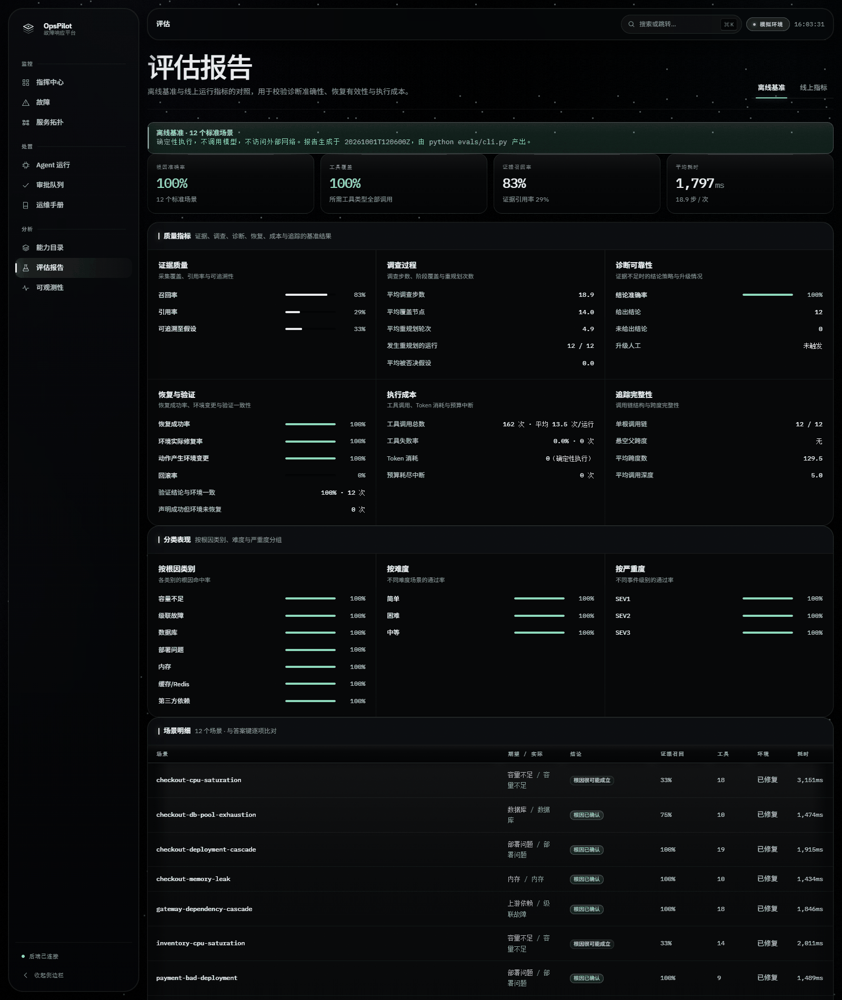

<picture>
  <source media="(prefers-color-scheme: dark)" srcset="brand/ops-pilot-horizontal-dark.svg" />
  
</picture>

面向生产环境的 AI 事故响应系统。15 个节点组成的 LangGraph 状态机覆盖故障定级、证据采集、假设验证、根因诊断、恢复审批、执行回滚与恢复验证，全过程可追溯。

线上地址：**https://opspilot-v2.app.workbuddy.host/?sharecode=RTXXSZUEYF**


## 1. 项目背景

生产事故的处理过程长期依赖值班工程师的个人经验：查看指标、检索日志、核对部署、提出假设并逐项验证。该过程存在四类结构性缺陷：

1. **过程不可追溯**。调查路径仅存在于工程师的工作记忆中，复盘时无法还原某条假设被排除的依据。
2. **结论不可验证**。根因判断缺少证据引用，难以区分推测与事实。
3. **恢复不可控**。高风险操作与常规操作执行同一套流程，缺少分级审批与回滚保障。
4. **质量不可评估**。响应能力无法量化，改进措施缺乏基准。

OpsPilot 将上述流程拆分为可执行、可审计的状态机节点，每一次调查均记录工具调用、证据来源、候选假设、验证结果、恢复动作与环境变更。

## 2. 目标用户与使用场景

| 角色 | 核心场景 |
| --- | --- |
| 值班工程师 | 告警接收、影响范围判断、证据采集、初步定级 |
| SRE / 运维负责人 | 高风险恢复审批、回滚决策、故障复盘 |
| 研发负责人 | 根因结论核对、改进项跟踪 |
| 质量与流程岗 | 响应能力评估、处置手册维护 |

## 3. 问题定义

| 问题 | 现状 | 目标 |
| --- | --- | --- |
| 调查过程无记录 | 复盘依赖回忆 | 每一步工具调用与证据落库，可按运行回放 |
| 根因缺少依据 | 结论以经验陈述为主 | 诊断结论必须引用具体证据，证据不足时输出 `UNKNOWN` |
| 恢复操作风险失控 | 审批依赖人工判断 | 按操作风险分四档，高风险强制审批，`critical` 操作直接拦截 |
| 处置能力无法量化 | 无统一评测 | 12 个标准场景离线评测，指标可复现 |

## 4. 产品目标与成功指标

| 目标 | 指标 | 当前结果 |
| --- | --- | --- |
| 诊断结论准确 | 根因准确率 | 100%（12 个场景） |
| 工具选择合理 | 工具选择准确率 | 100% |
| 恢复动作有效 | 恢复成功率 / 环境实际恢复率 | 100% / 100% |
| 结论可追溯 | 证据可追溯率 | 33.2% |
| 过程可回放 | 调用链完整性 | 12/12 单根，0 个悬空父跨度 |

当前主要质量缺口为证据利用率（29.2%），已纳入后续优化范围。

## 5. 解决方案概览

- **状态机驱动**：15 个节点声明输入、超时、预算与失败处理策略，节点仅返回状态增量。
- **证据优先**：证据经归一化、去重并标注可信度与时效，诊断结论必须引用证据。
- **分级审批**：恢复动作按风险分四档，高风险操作中断等待人工确认。
- **可回滚执行**：恢复失败或验证未通过时按预案回滚，变更全程记录。
- **离线可评测**：12 个标准场景使用确定性 Provider 运行，不依赖外部模型。

## 6. 功能范围

12 项能力均有独立页面，入口为 `/capabilities/{slug}`。

| 能力 | 路由 | 说明 |
| --- | --- | --- |
| 故障定级 | `/capabilities/triage` | 按影响范围、严重程度与时间窗口确定响应级别 |
| 证据采集 | `/capabilities/evidence` | 并行采集日志、指标、部署与变更记录 |
| 假设生成 | `/capabilities/hypothesis` | 生成候选根因并标注置信度与验证条件 |
| 假设验证 | `/capabilities/falsification` | 执行反证与交叉验证，未通过时重新规划 |
| 根因诊断 | `/capabilities/diagnosis` | 输出带证据引用的根因结论 |
| 恢复计划 | `/capabilities/recovery-plan` | 生成分步恢复方案、前置检查与回滚点 |
| 风险审批 | `/capabilities/approval` | 按操作风险执行分级审批 |
| 执行与回滚 | `/capabilities/recovery-execution` | 逐步执行恢复操作并记录环境变更 |
| 恢复验证 | `/capabilities/verification` | 对照基线校验恢复结果 |
| 服务拓扑 | `/capabilities/topology` | 展示服务依赖、健康状态与故障传播路径 |
| 运维手册 | `/capabilities/runbook` | 按故障场景维护标准处置步骤 |
| 离线评估 | `/capabilities/evaluation` | 使用基准场景评估诊断与恢复质量 |


### 6.1 执行流程

15 个节点运行在 LangGraph `StateGraph` 上。

| 节点 | 职责 |
| --- | --- |
| `load_context` | 加载服务拓扑、依赖与健康状态，建立调查上下文 |
| `triage` | 按影响范围与严重程度定级（SEV1–SEV4），确定时间窗口 |
| `investigation_planner` | 制定证据采集计划，避免无条件调用全部工具 |
| `parallel_investigation` | 并行执行工具调用，单点超时不阻塞整体调查 |
| `evidence_aggregation` | 归一化、去重并标注证据可信度与时效 |
| `hypothesis_generation` | 生成候选根因，标注置信度与验证条件 |
| `hypothesis_verification` | 执行反证与交叉验证，未通过时重新规划 |
| `root_cause_diagnosis` | 输出带证据引用的根因；证据不足时输出 `UNKNOWN` |
| `recovery_planner` | 生成分步恢复方案与回滚点 |
| `risk_assessment` | 按操作风险确定审批策略 |
| `human_approval` | 人工审批节点（LangGraph `interrupt`） |
| `recovery_executor` | 逐步执行恢复操作并记录环境变更 |
| `rollback` | 执行失败或验证未通过时按方案回滚 |
| `verification` | 对照服务基线验证恢复结果 |
| `postmortem` | 生成时间线、证据链、假设记录与遗留风险 |


运行状态由 `agent/state.py` 管理，检查点写入项目仓储层，进程重启后可从最近检查点恢复，等待人工审批的运行可在审批后继续执行。预算由 `agent/budget.py` 控制，覆盖 Token、工具调用次数与耗时；超预算时运行停止并记录原因。

## 7. 权限与安全设计

### 7.1 工具权限

工具在 `tools/registry.py` 中以声明式方式定义，共 22 个，按权限分为四类。

| 权限 | 数量 | 说明 |
| --- | ---: | --- |
| `read_only` | 10 | 查询服务状态、日志、指标、部署、变更、依赖与手册 |
| `mutate_infra` | 8 | 重启服务、扩容、清理缓存、调整连接池等基础设施操作 |
| `destructive` | 2 | 回滚部署、重启数据库等高影响操作 |
| `write_external` | 2 | 切换支付通道、创建 GitHub Issue 等外部写入 |

每个 `ToolSpec` 声明输入输出模型、超时、重试次数、风险等级、错误类型与所属 MCP Server。执行器支持幂等键，重复调用返回首次结果；调用前后钩子统一写入审计与指标。

### 7.2 恢复风险分级

策略定义在 `agent/recovery.py`。

| 风险 | 典型操作 | 执行策略 |
| --- | --- | --- |
| `low` | 单实例重启、临时扩容 | 自动执行 |
| `medium` | 滚动重启、配置热更新、清理缓存 | 自动执行并记录审计 |
| `high` | 回滚部署、切换支付通道 | 人工审批后执行 |
| `critical` | 数据变更、删除类操作 | 拦截，不进入审批队列 |

恢复执行完成后必须通过验证节点。验证以服务基线为准，未通过时触发回滚。评测中 `effective_action_rate` 与 `environment_fixed_rate` 分开统计，用于区分「动作返回成功」与「环境实际恢复」。

## 8. 技术架构

### 8.1 后端

Python 3.12、LangGraph、FastAPI。分层为 `api` / `services` / `agent` / `repositories` / `infrastructure` / `domain`，依赖方向自上而下，领域层不依赖框架。

### 8.2 前端

React 19、TypeScript、Vite，包含 9 个业务页面、能力目录与 12 个能力详情页。

- **设计系统**：颜色、圆角、间距、动效与透视参数集中在 `styles/tokens.css`，页面只引用令牌。
- **Gallery 视觉**：Three.js 生成程序化噪点纹理，用于 Hero、能力卡片与 About 板块；图片与纹理均本地加载。
- **能力目录**：12 张卡片分别指向独立详情页，避免多个入口复用同一页面。
- **SSE 事件流**：`GET /api/v1/agent/runs/{id}/stream` 支持从 `seq 0` 回放，并通过 `Last-Event-ID` 断点续传。
- **运行时间线**：步骤来自节点执行记录，事件来自 SSE 日志，两者独立展示，不依赖运行快照反推。
- **假设面板**：按 `seq` 折叠 `hypothesis.created` / `updated` / `rejected` 事件，展示候选假设的完整状态变化。
- **服务拓扑**：边来自模拟器真实的 `depends_on` 依赖图，按 dagre 分层布局；箭头由调用方指向被依赖方，线宽表示依赖强度，虚线表示缓存调用，节点与边随故障传播实时变色。


### 8.3 本地资源

- 字体：`@fontsource` 包在构建时输出到 `dist/assets/*.woff2`
- 能力图片：`apps/frontend/public/gallery/`
- 品牌标识：`apps/frontend/public/brand/`、`favicon.svg`、`apple-touch-icon.png`
- Swagger UI：`apps/backend/src/opspilot_backend/static/swagger-ui/`
- API 文档：`/docs` 使用本地 Swagger UI，`/redoc` 重定向至 `/docs`
- 构建校验：`npm run build` 的 `postbuild` 执行 `scripts/check-local-assets.mjs`，扫描外部脚本、样式、字体与图片地址，发现外部来源即构建失败

## 9. 质量验证

### 9.1 离线评测

覆盖 12 个标准场景，使用确定性 Provider，不调用外部模型。

| 指标 | 结果 |
| --- | --- |
| 场景数 / 执行错误 | 12 / 0 |
| 根因准确率 | 100% |
| 工具选择准确率 | 100% |
| 恢复成功率 | 100% |
| 验证准确率 | 100%（12 次计分，0 次误报成功） |
| 证据召回率 | 82.6% |
| 证据利用率 | 29.2% |
| 证据可追溯率 | 33.2% |
| 平均调查步数 | 18.9 |
| 平均覆盖节点 | 14.0 |
| 平均重规划轮次 | 4.9（12/12 次运行触发重规划） |
| 工具调用总数 | 162（平均 13.5 次/运行，失败 0 次） |
| 平均耗时 | 1,797 ms（P50 1,668 / P95 2,528） |
| 调用链完整性 | 12/12 单根，0 个悬空父跨度 |



### 9.2 测试

```bash
# 后端
cd apps/backend
PYTHONPATH=src python -m pytest tests -q

# 前端
cd apps/frontend
npm run build
npm run lint

# 离线评测
cd evals
python cli.py
```

后端测试覆盖工具失败、超时、级联失败、恢复回滚、幂等、调用链完整性、时间线契约、故障状态迁移、标签完整性、部署数据库与请求校验错误等场景。

## 10. 范围边界与已知限制

- 证据利用率目前为 29.2%，仍有较多已采集证据未进入最终诊断引用。
- 生产模式依赖 OpenAI 兼容模型服务；离线评测使用确定性 Provider，不代表线上模型延迟。
- GitHub 集成仅在配置 `GITHUB_TOKEN` 与 `GITHUB_REPO` 时调用外部 API，默认关闭。
- 运行时静态资源已全部本地化；模型 API 属于外部服务，无法作为静态文件打包。
- 不提供无人值守的自动修复：所有高影响恢复动作均需人工审批。

## 11. 部署与本地运行

### 11.1 部署包

由 `scripts/build_deploy.py` 生成：

```
deploy/
├── src/            # 后端与内嵌模拟器
├── webroot/        # 编译后的 SPA
├── runbooks/       # 运维手册
├── opspilot.db     # 仅包含 schema
├── requirements.txt
└── serve.py
```

- 单端口模式下，FastAPI 同时提供 API、SSE、模拟器与 SPA。
- 入口页 `index.html` 与 SPA 回落路由返回 `Cache-Control: no-cache, no-store, must-revalidate`。
- `/assets/*` 为带哈希的静态资源，返回 `public, max-age=31536000, immutable`。
- `OPSPILOT_EMBED_SIMULATOR=true` 将模拟器挂载到 `/__sim`，无需额外进程。
- `opspilot.db` 只包含 schema，演示数据由 `OPSPILOT_DEMO_SEED` 在启动时生成。

```bash
cd apps/frontend && npm run build
cd ../.. && python scripts/build_deploy.py
cd deploy && python serve.py
```

### 11.2 本地运行

前置环境：Python 3.12+、Node.js 20+。

```bash
# 后端
cd apps/backend
python -m venv .venv
# Windows
.venv\Scripts\activate
pip install -r requirements.txt
python serve.py

# 前端
cd apps/frontend
npm install
npm run dev
```

开发模式下前端运行于 `http://localhost:5173`，后端运行于 `http://localhost:8000`，CORS 已配置。

模型通过 OpenAI 兼容接口接入，默认配置为智谱 GLM-4-Flash：

```bash
cp .env.example .env
# OPENAI_BASE_URL=https://open.bigmodel.cn/api/paas/v4
# OPENAI_MODEL=glm-4-flash
# OPENAI_API_KEY=<key>
```

完全离线运行时，可将 `OPENAI_BASE_URL` 指向本地 OpenAI 兼容服务（如 Ollama、vLLM）。

## 12. 目录结构

```
OpsPilot/
├── apps/
│   ├── backend/src/opspilot_backend/
│   │   ├── agent/              # LangGraph 图、节点、预算、检查点、LLM 抽象
│   │   ├── api/v1/endpoints/    # agent / incidents / services / simulator / metrics / health
│   │   ├── core/                # 配置、日志、指标、链路
│   │   ├── domain/              # 枚举与领域错误
│   │   ├── infrastructure/      # Provider 装配、HTTP 客户端、容器
│   │   ├── mcp/                 # MCP 客户端
│   │   ├── models/              # 数据模型
│   │   ├── repositories/        # 数据访问
│   │   ├── services/            # 运行编排、事件流、工具钩子
│   │   ├── static/swagger-ui/   # 本地 Swagger UI
│   │   └── main.py
│   └── frontend/src/
│       ├── components/gallery/  # Gallery 与能力内容模型
│       ├── pages/               # 业务页面与能力详情页
│       ├── shell/               # 外壳、侧栏、命令面板、错误边界
│       ├── styles/              # tokens / primitives / patterns
│       └── three/               # 噪点纹理与全屏场景
├── evals/                       # 评测数据集、Runner、指标聚合
├── runbooks/                    # Markdown 运维手册
├── simulator/                   # 独立模拟器（12 个场景）
├── infra/                       # Prometheus / OpenTelemetry 配置
├── scripts/build_deploy.py      # 单端口部署包
├── docs/images/                 # README 配图
├── docker-compose.yml           # 本地完整栈
└── .github/workflows/           # CI
```

## License

MIT
